# Diagrams Library

This document contains all diagrams for the A2A presentation. Each diagram includes:
- **Title and ID** - For quick reference
- **When to show** - At which point in the presentation
- **Purpose** - What this diagram explains
- **Simple explanation** - B2-level English description
- **The diagram** - Ready to use

---

## Table of Contents

### A2A Protocol Diagrams (Main Focus)
1. [Agent Discovery Flow](#1-agent-discovery-flow)
2. [Message Send and Response](#2-message-send-and-response)
3. [SSE Streaming Sequence](#3-sse-streaming-sequence)
4. [Webhook Notification Flow](#4-webhook-notification-flow)
5. [Blocking vs Non-Blocking Comparison](#5-blocking-vs-non-blocking-comparison)
6. [Agent Card Structure](#6-agent-card-structure)
7. [Task Lifecycle](#7-task-lifecycle)
8. [Agent-to-Agent Communication Pattern](#8-agent-to-agent-communication-pattern)
9. [Message Parts Types](#9-message-parts-types)
10. [Error Handling Flow](#10-error-handling-flow)
11. [Agent Registration Process](#11-agent-registration-process)
12. [Protocol Handshake](#12-protocol-handshake)
13. [Heartbeat Mechanism](#13-heartbeat-mechanism)
14. [Push vs Pull Communication](#14-push-vs-pull-communication)
15. [Multi-Agent Coordination](#15-multi-agent-coordination)

### Project Architecture Diagrams
16. [System Overview](#16-system-overview)
17. [Travel Planner Orchestration](#17-travel-planner-orchestration)
18. [Complete Demo Flow](#18-complete-demo-flow)
19. [Agent Communication Layers](#19-agent-communication-layers)
20. [Three-File Agent Pattern](#20-three-file-agent-pattern)
21. [Client-Server Architecture](#21-client-server-architecture)
22. [Event Bus Pattern](#22-event-bus-pattern)
23. [Request Context Flow](#23-request-context-flow)

### MCP Extension Diagrams
24. [A2A + MCP Combination](#24-a2a--mcp-combination)
25. [Calculator Agent with MCP](#25-calculator-agent-with-mcp)
26. [Horizontal vs Vertical Protocols](#26-horizontal-vs-vertical-protocols)

---

## A2A Protocol Diagrams

### 1. Agent Discovery Flow

**When to show:** Part 3 - A2A Core Concepts (Discovery section)

**Purpose:** Show how a client finds and connects to an agent

**Simple explanation:**
Before agents can talk, they need to find each other. The client asks "Who are you?" and the agent sends back its card. This card tells the client what the agent can do.

**Diagram:**

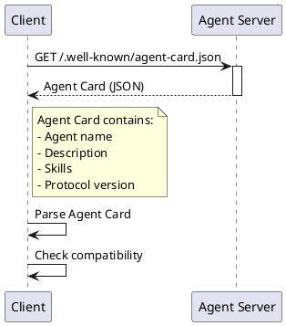

---

### 2. Message Send and Response

**When to show:** Part 3 - A2A Core Concepts (Messages section)

**Purpose:** Show the basic request-response pattern

**Simple explanation:**
This is how agents send messages to each other. The client sends a message with a question. The agent thinks and sends back an answer. It's like sending an email and getting a reply.

**Diagram:**

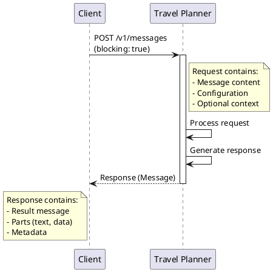

---

### 3. SSE Streaming Sequence

**When to show:** Part 3 - A2A Core Concepts (SSE Streaming section)

**Purpose:** Show how real-time updates work with Server-Sent Events

**Simple explanation:**
SSE lets the agent send updates while it works. The client doesn't wait in silence - it sees progress in real time. Like watching a progress bar fill up instead of just waiting for "Done!".

**Diagram:**

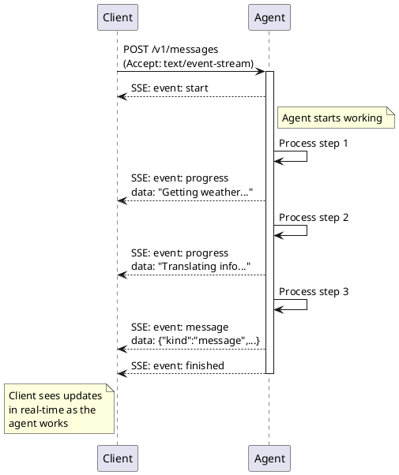

---

### 4. Webhook Notification Flow

**When to show:** Part 3 - A2A Core Concepts (Webhooks section)

**Purpose:** Show how agents push notifications to clients

**Simple explanation:**
With webhooks, the agent calls YOU when it's done. You don't need to wait or keep asking "Are you done yet?". The agent will tell you when it finishes. It's like giving someone your phone number instead of calling them every minute.

**Diagram:**

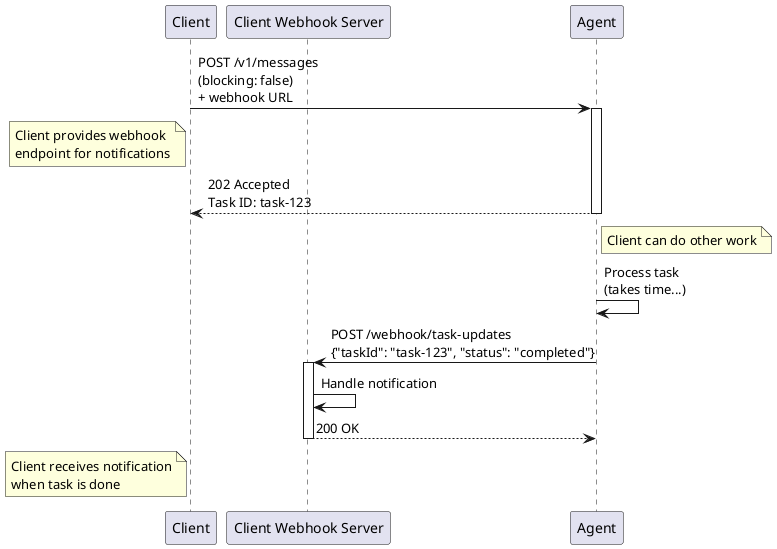

---

### 5. Blocking vs Non-Blocking Comparison

**When to show:** Part 3 - A2A Core Concepts (Messages section)

**Purpose:** Compare synchronous and asynchronous modes

**Simple explanation:**
Blocking = Wait for answer (like a phone call). Non-blocking = Get answer later (like sending a text message). Choose blocking for fast tasks, non-blocking for slow tasks.

**Diagram:**

```
┌─────────────────────────────────────────────────────────────────┐
│                    BLOCKING MODE (Synchronous)                  │
└─────────────────────────────────────────────────────────────────┘

Client                          Agent
  │                               │
  │──── Send Message ────────────>│
  │                               │
  │         (Client waits)        │ ◄── Processing...
  │                               │
  │<──── Response ────────────────│
  │                               │
  └─ Continue work                │

✅ Use when: Quick tasks (< 30 seconds)
✅ Simple: One request, one response
❌ Client must wait


┌─────────────────────────────────────────────────────────────────┐
│                 NON-BLOCKING MODE (Asynchronous)                │
└─────────────────────────────────────────────────────────────────┘

Client                          Agent
  │                               │
  │──── Send Message + Webhook ──>│
  │                               │
  │<──── 202 Accepted + Task ID ──│
  │                               │
  └─ Do other work                │ ◄── Processing...
  │                               │    (takes time)
  │                               │
  │<──── Webhook: Task Done ──────│
  │                               │
  └─ Handle result                │

✅ Use when: Long tasks (> 30 seconds)
✅ Client can do other work
✅ Get notification when done
❌ More complex setup
```

---

### 6. Agent Card Structure

**When to show:** Part 3 - A2A Core Concepts (Agent Cards section)

**Purpose:** Show what information an Agent Card contains

**Simple explanation:**
The Agent Card is like a business card. It tells you the agent's name, what it can do, and how to talk to it. Every agent has one.

**Diagram:**

```
┌───────────────────────────────────────────────────────────────┐
│                      AGENT CARD                               │
├───────────────────────────────────────────────────────────────┤
│                                                               │
│  {                                                            │
│    "protocolVersion": "0.1.0",          ◄── Protocol version │
│    "name": "Weather Agent",             ◄── Agent name       │
│    "description": "Weather forecasts",  ◄── What it does     │
│                                                               │
│    "skills": [                          ◄── What it can do   │
│      {                                                        │
│        "name": "get_weather",                                 │
│        "description": "Get weather for a city",               │
│        "input": {                                             │
│          "type": "object",                                    │
│          "properties": {                                      │
│            "city": { "type": "string" },                      │
│            "days": { "type": "number" }                       │
│          }                                                    │
│        }                                                      │
│      }                                                        │
│    ]                                                          │
│  }                                                            │
│                                                               │
└───────────────────────────────────────────────────────────────┘

Key parts:
• Protocol version: Which A2A version
• Name: Agent identity
• Description: What it does
• Skills: List of capabilities with inputs/outputs
```

---

### 7. Task Lifecycle

**When to show:** Part 3 - A2A Core Concepts (Tasks section)

**Purpose:** Show how tasks progress through different states

**Simple explanation:**
When an agent does long work, it creates a task. The task goes through different states: pending (waiting), in progress (working), completed (done), or failed (error). You can check the task status at any time.

**Diagram:**

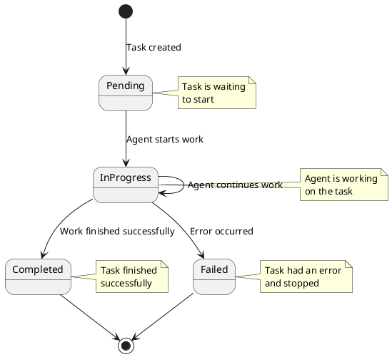

---

### 8. Agent-to-Agent Communication Pattern

**When to show:** Part 4 - A2A in Our Project

**Purpose:** Show how agents communicate with each other (not just client-agent)

**Simple explanation:**
Agents can talk to other agents! One agent can ask another agent for help. The Travel Planner does this - it asks the Weather Agent and Translation Agent for information.

**Diagram:**

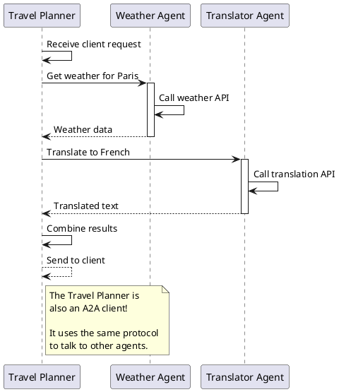

---

### 9. Message Parts Types

**When to show:** Part 3 - A2A Core Concepts (Messages section)

**Purpose:** Show different types of content that can be in a message

**Simple explanation:**
Messages can contain different types of information: text, images, files, data, or errors. Like sending an email with text and attachments.

**Diagram:**

```
┌─────────────────────────────────────────────────────────────┐
│                     MESSAGE PARTS                           │
├─────────────────────────────────────────────────────────────┤
│                                                             │
│  A Message contains one or more "parts":                    │
│                                                             │
│  ┌──────────────────┐                                       │
│  │  TEXT PART       │  Plain text content                   │
│  │  kind: "text"    │  "The weather is sunny"               │
│  └──────────────────┘                                       │
│                                                             │
│  ┌──────────────────┐                                       │
│  │  DATA PART       │  Structured data (JSON)               │
│  │  kind: "data"    │  { temp: 25, city: "Paris" }          │
│  └──────────────────┘                                       │
│                                                             │
│  ┌──────────────────┐                                       │
│  │  IMAGE PART      │  Image file                           │
│  │  kind: "image"   │  (base64 or URL)                      │
│  └──────────────────┘                                       │
│                                                             │
│  ┌──────────────────┐                                       │
│  │  FILE PART       │  Any file attachment                  │
│  │  kind: "file"    │  PDF, CSV, etc.                       │
│  └──────────────────┘                                       │
│                                                             │
│  ┌──────────────────┐                                       │
│  │  ERROR PART      │  Error information                    │
│  │  kind: "error"   │  { message: "Failed", code: 500 }     │
│  └──────────────────┘                                       │
│                                                             │
└─────────────────────────────────────────────────────────────┘

Example message with multiple parts:
{
  "role": "agent",
  "parts": [
    { "kind": "text", "text": "Here is the weather:" },
    { "kind": "data", "data": { "temp": 25 } }
  ]
}
```

---

### 10. Error Handling Flow

**When to show:** Part 3 - A2A Core Concepts (if asked about errors)

**Purpose:** Show how errors are handled in A2A

**Simple explanation:**
When something goes wrong, the agent sends back an error message. The client can see what happened and decide what to do next. Errors are just special messages.

**Diagram:**

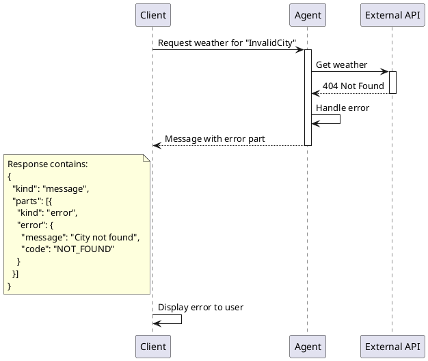

---

### 11. Agent Registration Process

**When to show:** Part 4 - A2A in Our Project (if asked about setup)

**Purpose:** Show how agents start up and become available

**Simple explanation:**
When an agent starts, it prepares its card and starts its server. Then it waits for requests. It's like opening a shop - you prepare your products, open the door, and wait for customers.

**Diagram:**

```
┌───────────────────────────────────────────────────────────┐
│              AGENT STARTUP PROCESS                        │
└───────────────────────────────────────────────────────────┘

    ┌─────────────┐
    │   START     │
    └──────┬──────┘
           │
           ▼
    ┌─────────────────────┐
    │ Load Agent Card     │  ◄── Read metadata
    │ (name, skills, etc) │
    └──────┬──────────────┘
           │
           ▼
    ┌─────────────────────┐
    │ Initialize Executor │  ◄── Set up business logic
    │ (connect to APIs)   │
    └──────┬──────────────┘
           │
           ▼
    ┌─────────────────────┐
    │ Start Express Server│  ◄── Listen for requests
    │ on port (e.g. 4000) │
    └──────┬──────────────┘
           │
           ▼
    ┌─────────────────────┐
    │ Register A2A Routes │  ◄── /v1/messages, /agent-card
    │ (/.well-known/...)  │
    └──────┬──────────────┘
           │
           ▼
    ┌─────────────────────┐
    │   READY & WAITING   │  ◄── Agent is live!
    │  for client requests│
    └─────────────────────┘
```

---

### 12. Protocol Handshake

**When to show:** Part 3 - A2A Core Concepts (Discovery section, detailed)

**Purpose:** Show the complete handshake when a client first connects

**Simple explanation:**
Before talking, the client and agent check if they speak the same language (protocol version). If they match, they can communicate. If not, the client knows it needs to update or find another agent.

**Diagram:**

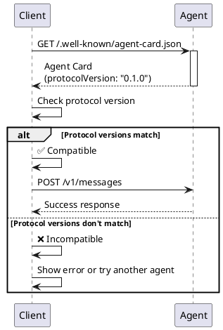

---

### 13. Heartbeat Mechanism

**When to show:** Part 3 - A2A Core Concepts (SSE section, if asked about connections)

**Purpose:** Show how SSE connections stay alive

**Simple explanation:**
During long work, the agent sends "I'm still here" messages. This keeps the connection open. Like saying "still working..." every few seconds so the other person knows you didn't disappear.

**Diagram:**

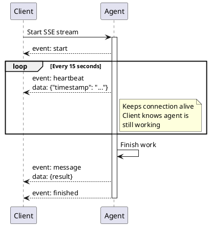

---

### 14. Push vs Pull Communication

**When to show:** Part 3 - A2A Core Concepts (comparing patterns)

**Purpose:** Compare push (webhooks) and pull (polling) patterns

**Simple explanation:**
Pull = You ask "Are you done?" many times. Push = Agent tells you "I'm done!" once. Push is better - less work, faster response.

**Diagram:**

```
┌─────────────────────────────────────────────────────────┐
│              PULL (Polling) - Not efficient             │
└─────────────────────────────────────────────────────────┘

Client                        Agent
  │                             │
  │──── "Are you done?" ───────>│
  │<──── "No" ──────────────────│
  │                             │
  │ Wait 5 seconds              │
  │                             │
  │──── "Are you done?" ───────>│
  │<──── "No" ──────────────────│
  │                             │
  │ Wait 5 seconds              │
  │                             │
  │──── "Are you done?" ───────>│
  │<──── "Yes! Here's result" ──│

❌ Many requests
❌ Wasted network calls
❌ Delayed response


┌─────────────────────────────────────────────────────────┐
│           PUSH (Webhook) - Efficient                    │
└─────────────────────────────────────────────────────────┘

Client                        Agent
  │                             │
  │──── Start task + webhook ──>│
  │<──── "OK, I'll call you" ───│
  │                             │
  │ Do other work               │ ◄── Working...
  │                             │    (client waits)
  │                             │
  │<──── "Done! Here's result" ─│
  │                             │

✅ One notification
✅ No wasted calls
✅ Instant response when ready
```

---

### 15. Multi-Agent Coordination

**When to show:** Part 4 - A2A in Our Project (orchestration)

**Purpose:** Show how one agent coordinates multiple other agents

**Simple explanation:**
The Travel Planner is like a manager. It asks different agents for information, waits for all answers, then combines them into one report. This is called orchestration.

**Diagram:**

```plantuml
@startuml
participant "Client" as C
participant "Travel Planner" as TP
participant "Weather" as W
participant "Web Search" as WS
participant "Translator" as T

C -> TP: "Plan trip to Paris"
activate TP

par Parallel requests
    TP -> W: Get weather
    activate W
    W --> TP: Weather data
    deactivate W
and
    TP -> WS: Search attractions
    activate WS
    WS --> TP: Attractions list
    deactivate WS
and
    TP -> T: Translate info
    activate T
    T --> TP: Translated text
    deactivate T
end

TP -> TP: Combine all results
TP -> TP: Generate itinerary

TP --> C: Complete travel plan
deactivate TP

note right of TP
  Travel Planner is an
  orchestrator agent.

  It coordinates multiple
  agents and combines
  their results.
end note

@enduml
```

---

## Project Architecture Diagrams

### 16. System Overview

**When to show:** Part 4 - A2A in Our Project (introduction)

**Purpose:** Show the complete system with all 5 agents

**Simple explanation:**
Our system has 5 agents. The Travel Planner is the main one - it talks to all the others. The client only talks to the Travel Planner. Each agent does one specific job.

**Diagram:**

```
┌─────────────────────────────────────────────────────────────┐
│              A2A TRAVEL PLANNING SYSTEM                     │
└─────────────────────────────────────────────────────────────┘

                    ┌──────────────┐
                    │    Client    │
                    │ (travel-demo)│
                    └───────┬──────┘
                            │ A2A Protocol
                            │
                    ┌───────▼──────────┐
                    │ Travel Planner   │  Port 4002
                    │   (Orchestrator) │
                    └───────┬──────────┘
                            │
            ┌───────────────┼───────────────┐
            │               │               │
            │ A2A           │ A2A           │ A2A
            │               │               │
    ┌───────▼──────┐ ┌─────▼─────┐ ┌──────▼─────┐
    │   Weather    │ │ Translator│ │ Web Search │
    │    Agent     │ │   Agent   │ │   Agent    │
    │  Port 4000   │ │ Port 4001 │ │ Port 4003  │
    └──────┬───────┘ └─────┬─────┘ └──────┬─────┘
           │               │               │
           │               │               │ A2A
           │               │        ┌──────▼─────┐
           │               │        │ Calculator │
           │               │        │   Agent    │
           │               │        │ Port 4004  │
           │               │        └──────┬─────┘
           │               │               │
           ▼               ▼               ▼
    ┌─────────────────────────────────────────┐
    │        External Services                │
    │  • OpenWeatherMap API                   │
    │  • Google Gemini AI                     │
    │  • Brave Search API                     │
    │  • MCP Math Server                      │
    └─────────────────────────────────────────┘

Key Points:
• All agents use A2A protocol
• Travel Planner = Orchestrator (coordinates others)
• Each agent has specific job
• Client only talks to Travel Planner
```

---

### 17. Travel Planner Orchestration

**When to show:** Part 4 - A2A in Our Project (detailed flow)

**Purpose:** Show exactly what happens in the Travel Planner when it orchestrates

**Simple explanation:**
The Travel Planner follows steps: receive request, ask other agents for information, wait for all answers, generate the final itinerary, send result to client. Everything happens in order.

**Diagram:**

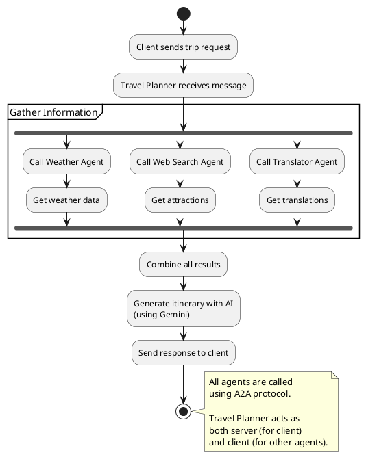

---

### 18. Complete Demo Flow

**When to show:** Part 2 - Live Demo (to explain what's happening)

**Purpose:** Show the complete flow from user input to final result

**Simple explanation:**
This shows everything that happens from when you type your request until you see the result. Many things happen behind the scenes!

**Diagram:**

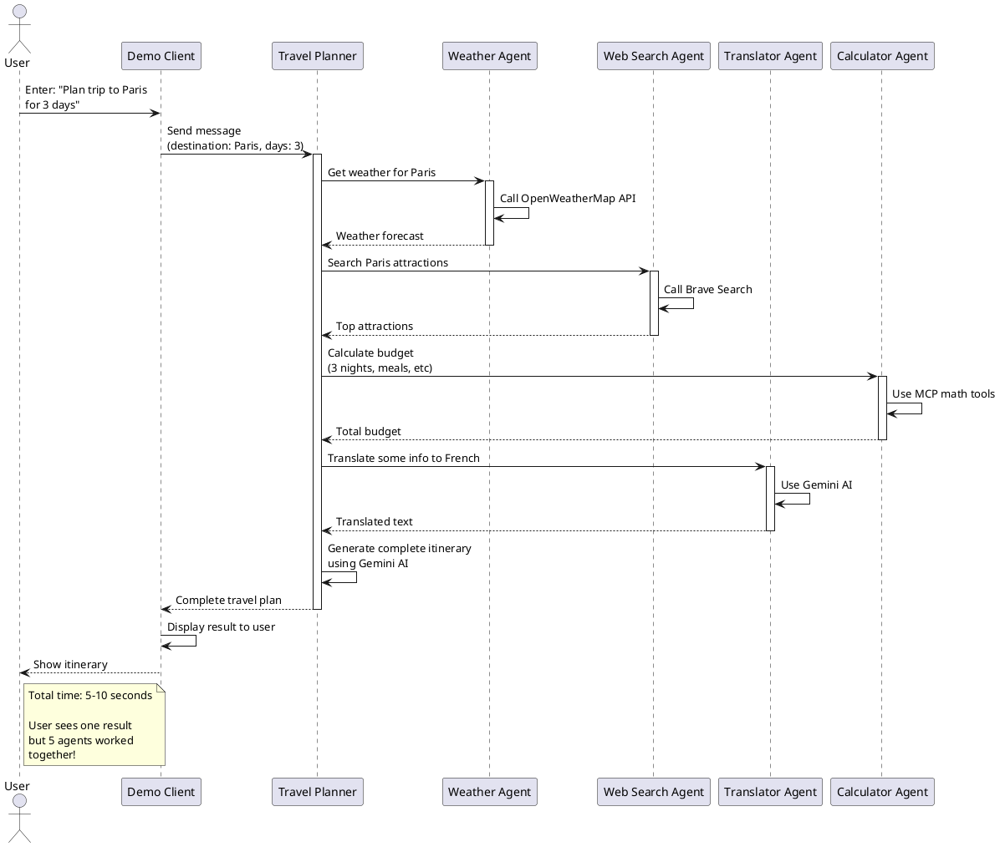

---

### 19. Agent Communication Layers

**When to show:** Part 3 - A2A Core Concepts (architecture detail)

**Purpose:** Show the different layers in agent architecture

**Simple explanation:**
An agent has layers like a cake. Top layer = HTTP server (receives requests). Middle layer = A2A logic (processes A2A messages). Bottom layer = business logic (does the actual work). Each layer has a specific job.

**Diagram:**

```
┌─────────────────────────────────────────────────────────┐
│                    AGENT LAYERS                         │
└─────────────────────────────────────────────────────────┘

     ┌────────────────────────────────────────┐
     │   HTTP Layer (Express Server)          │
     │   • Receive HTTP requests              │ ◄── PORT 4000
     │   • Send HTTP responses                │
     └──────────────┬─────────────────────────┘
                    │
                    ▼
     ┌────────────────────────────────────────┐
     │   A2A Protocol Layer                   │
     │   • Parse A2A messages                 │
     │   • Handle SSE streaming               │
     │   • Manage webhooks                    │
     │   • Execute agent card                 │
     └──────────────┬─────────────────────────┘
                    │
                    ▼
     ┌────────────────────────────────────────┐
     │   Business Logic Layer (Executor)      │
     │   • Do the actual work                 │
     │   • Call external APIs                 │
     │   • Process data                       │
     │   • Generate responses                 │
     └────────────────────────────────────────┘
                    │
                    ▼
     ┌────────────────────────────────────────┐
     │   External Services                    │
     │   • Weather API                        │
     │   • AI models                          │
     │   • Databases                          │
     └────────────────────────────────────────┘

Flow:
1. HTTP request arrives at server
2. A2A layer parses the message
3. Business logic processes it
4. External services provide data
5. Response goes back up through layers
```

---

### 20. Three-File Agent Pattern

**When to show:** Part 4 - A2A in Our Project (agent structure)

**Purpose:** Show how our agents are organized in code

**Simple explanation:**
Every agent follows the same pattern: 3 files. One file describes the agent (card), one file does the work (executor), one file starts the server. This makes all agents consistent and easy to understand.

**Diagram:**

```
┌─────────────────────────────────────────────────────────┐
│          THREE-FILE AGENT PATTERN                       │
└─────────────────────────────────────────────────────────┘

src/agents/weather-agent/
│
├── agent-card.ts         ◄── WHO AM I?
│   • Agent metadata (name, description)
│   • Skills definition
│   • Input/output schemas
│   • Protocol version
│
│   Example:
│   export const weatherAgentCard = {
│     name: "Weather Agent",
│     skills: [...]
│   };
│
├── executor.ts           ◄── WHAT DO I DO?
│   • Business logic
│   • Process requests
│   • Call external APIs
│   • Generate responses
│
│   Example:
│   class WeatherExecutor implements AgentExecutor {
│     async execute(context, eventBus) {
│       // Do the work here
│     }
│   }
│
└── server.ts             ◄── HOW DO I START?
    • Create Express app
    • Register A2A routes
    • Start listening on port
    • Handle shutdown

    Example:
    const app = createA2AExpressApp(
      weatherAgentCard,
      () => new WeatherExecutor()
    );
    app.listen(4000);


✅ Benefits:
• Consistent structure across all agents
• Easy to find things
• Easy to add new agents
• Separation of concerns
```

---

### 21. Client-Server Architecture

**When to show:** Part 4 - A2A in Our Project (if asked about client)

**Purpose:** Show the relationship between client and server in A2A

**Simple explanation:**
The client is the one who asks questions. The server is the one who answers. In A2A, agents can be both! The Travel Planner is a server (for the demo client) and a client (for other agents).

**Diagram:**

```
┌─────────────────────────────────────────────────────────┐
│              CLIENT-SERVER IN A2A                       │
└─────────────────────────────────────────────────────────┘

┌────────────────────────────────────┐
│        Demo Client (travel-demo)   │  ◄── Pure Client
│        • Only sends requests       │
│        • Never receives requests   │
│        • Uses A2AClient class      │
└──────────────┬─────────────────────┘
               │ A2A
               │ Request
               ▼
┌────────────────────────────────────┐
│       Travel Planner Agent         │  ◄── Both!
│       • Receives from client       │     (Server + Client)
│       • Sends to other agents      │
│       • Uses both A2AExpressApp    │
│         and A2AClient              │
└──────────────┬─────────────────────┘
               │ A2A
               │ Request
               ▼
┌────────────────────────────────────┐
│       Weather Agent                │  ◄── Pure Server
│       • Only receives requests     │
│       • Never sends requests       │
│       • Uses A2AExpressApp         │
└────────────────────────────────────┘


Key Concept:
• Client = Sends A2A messages
• Server = Receives A2A messages
• An agent can be both at the same time!
```

---

### 22. Event Bus Pattern

**When to show:** Part 4 - A2A in Our Project (if asked about events)

**Purpose:** Show how agents publish events internally

**Simple explanation:**
The Event Bus is like a messenger inside the agent. When the agent has updates (progress, results, errors), it tells the Event Bus. The Event Bus then sends these updates to the client via SSE.

**Diagram:**

```
┌─────────────────────────────────────────────────────────┐
│              EVENT BUS PATTERN                          │
└─────────────────────────────────────────────────────────┘

    Executor                Event Bus              SSE Stream
    (Business Logic)        (Messenger)            (To Client)

    ┌──────────┐            ┌──────────┐           ┌────────┐
    │          │            │          │           │        │
    │  Start   │───────────>│ publish()│──────────>│ event: │
    │  work    │  "start"   │          │           │ start  │
    │          │            │          │           │        │
    └────┬─────┘            └──────────┘           └────────┘
         │
         │ (do work...)
         │
    ┌────▼─────┐            ┌──────────┐           ┌────────┐
    │          │            │          │           │        │
    │ Progress │───────────>│ publish()│──────────>│ event: │
    │ update   │  message   │          │           │ message│
    │          │            │          │           │        │
    └────┬─────┘            └──────────┘           └────────┘
         │
         │ (finish work)
         │
    ┌────▼─────┐            ┌──────────┐           ┌────────┐
    │          │            │          │           │        │
    │ Finished │───────────>│ finished│──────────>│ event: │
    │          │            │   ()     │           │finished│
    │          │            │          │           │        │
    └──────────┘            └──────────┘           └────────┘

Code example:
  async execute(context, eventBus) {
    // Executor publishes events
    eventBus.publish({ kind: "message", ... });

    // Event Bus forwards to SSE
    // Client receives real-time updates

    eventBus.finished();
  }
```

---

### 23. Request Context Flow

**When to show:** Part 4 - A2A in Our Project (if asked about request handling)

**Purpose:** Show how request context flows through the system

**Simple explanation:**
When a request arrives, it brings "context" - information about the request (who sent it, what they want, configuration). This context travels through all the layers so each part knows what to do.

**Diagram:**

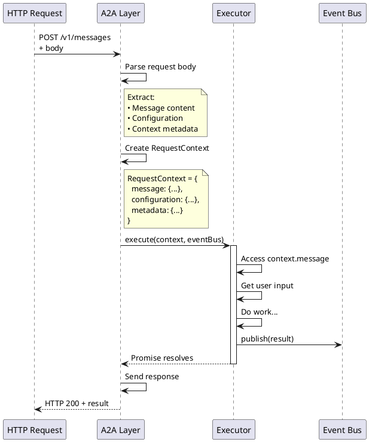

---

## MCP Extension Diagrams

### 24. A2A + MCP Combination

**When to show:** Part 5 - MCP + A2A Combination

**Purpose:** Show how A2A and MCP work together

**Simple explanation:**
A2A connects agents (horizontal - agents talk to agents). MCP connects agents to tools (vertical - agent uses tools). Together, they make agents that can communicate AND use tools. Best of both!

**Diagram:**

```
┌─────────────────────────────────────────────────────────┐
│           A2A + MCP: TWO PROTOCOLS COMBINED             │
└─────────────────────────────────────────────────────────┘


         Client
           │
           │ A2A Protocol (horizontal)
           │ "Agents talking to agents"
           ▼
     Travel Planner ──────────┐
           │                  │
           │                  │ A2A
           │                  │
           ▼                  ▼
      Weather Agent    Calculator Agent
           │                  │
      ┌────┘                  └────┐
      │                            │
      │ MCP Protocol               │ MCP Protocol
      │ (vertical)                 │ (vertical)
      │ "Agent using tools"        │ "Agent using tools"
      │                            │
      ▼                            ▼
  Weather API                  Math Tools
  • get_forecast               • add
  • get_temp                   • multiply
                               • calculate_budget


┌────────────────────────────────────────────────────┐
│                  COMPARISON                        │
├────────────────────────────────────────────────────┤
│                                                    │
│  A2A (Horizontal)          MCP (Vertical)          │
│  ================          ================        │
│  • Agent ↔ Agent           • Agent → Tool          │
│  • Communication           • Augmentation          │
│  • Conversation            • Function call         │
│  • Example:                • Example:              │
│    "Ask Weather Agent"       "Use calculator"     │
│                                                    │
└────────────────────────────────────────────────────┘

Why combine them?
✅ Agents can talk to each other (A2A)
✅ Agents can use precise tools (MCP)
✅ Best of both worlds!
```

---

### 25. Calculator Agent with MCP

**When to show:** Part 5 - MCP + A2A Combination (example)

**Purpose:** Show concrete example of MCP usage in our project

**Simple explanation:**
The Calculator Agent uses MCP to do math. It has a "math server" that provides calculator tools (add, multiply, budget calculation). The agent asks the server to do the math instead of calculating itself. This makes calculations more accurate.

**Diagram:**

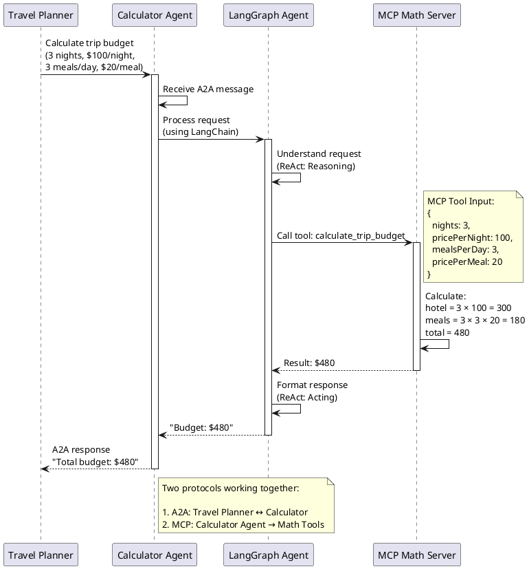

---

### 26. Horizontal vs Vertical Protocols

**When to show:** Part 5 - MCP + A2A Combination (concept)

**Purpose:** Explain the difference between horizontal (A2A) and vertical (MCP) communication

**Simple explanation:**
Think of a company. Horizontal = employees talking to each other (collaboration). Vertical = employee using tools/equipment (getting work done). A2A = horizontal communication between agents. MCP = vertical access to tools. Both are needed!

**Diagram:**

```
┌──────────────────────────────────────────────────────────┐
│       HORIZONTAL vs VERTICAL COMMUNICATION               │
└──────────────────────────────────────────────────────────┘


HORIZONTAL (A2A Protocol)
─────────────────────────
Agent to Agent communication

    Agent A  ←──────→  Agent B  ←──────→  Agent C

    • Equal level (peer-to-peer)
    • Conversational
    • Exchange information
    • Collaborate on tasks

    Example: "Weather Agent, what's the forecast?"


VERTICAL (MCP Protocol)
───────────────────────
Agent to Tool communication

         Agent A
            │
            │ (uses tool)
            │
            ▼
         Tool 1

         Agent B
            │
            │ (uses tool)
            │
            ▼
         Tool 2

    • Different levels (agent above, tool below)
    • Functional
    • Execute specific actions
    • Get precise results

    Example: "Calculator tool, multiply 5 by 3"


COMBINED (A2A + MCP)
────────────────────
Full power!

    Client ────→ Agent A ←────→ Agent B
                    │              │
                    │              │
                    ▼              ▼
                  Tool 1         Tool 2

    • Agents communicate (A2A horizontal)
    • Agents use tools (MCP vertical)
    • Complete system!

    Example:
    "Travel Planner (A2A)→ asks Calculator Agent
     Calculator Agent (MCP)→ uses math tools
     Calculator Agent (A2A)← sends result back"
```

---

## How to Use This Library

### During Presentation

1. **Keep this file open** on a second screen or print it
2. **Reference diagrams by number** (e.g., "Let me show you diagram #3")
3. **Use the simple explanations** when introducing each diagram
4. **Show the actual diagram** on the main screen

### Choosing Which Diagrams to Show

**Must show (core diagrams):**
- #2: Message Send and Response
- #3: SSE Streaming Sequence
- #4: Webhook Notification Flow
- #6: Agent Card Structure
- #16: System Overview
- #18: Complete Demo Flow

**Show if time allows:**
- #5: Blocking vs Non-Blocking
- #17: Travel Planner Orchestration
- #24: A2A + MCP Combination

**Show only if asked:**
- All others (keep as backup for questions)

### Tips

- **Don't show too many diagrams** - 6-8 is enough for 30 minutes
- **Explain BEFORE showing** - tell what they'll see, then show it
- **Point at diagram parts** - use cursor/laser pointer to guide eyes
- **Use simple explanations** - the ones provided in B2 English
- **Connect to demo** - refer back to what they saw in the demo

---

**End of Diagrams Library**
